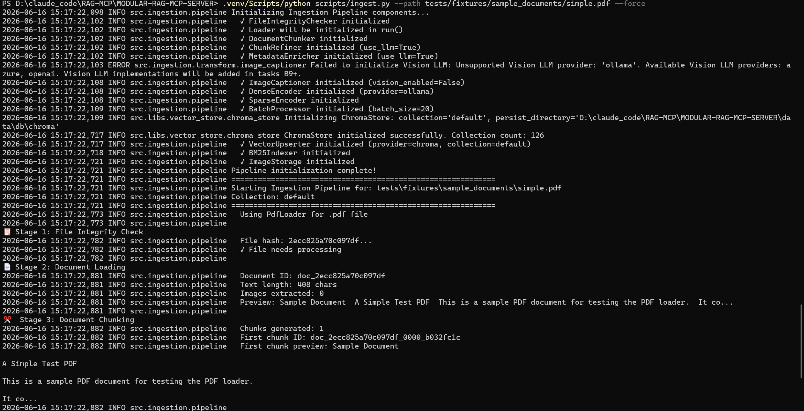
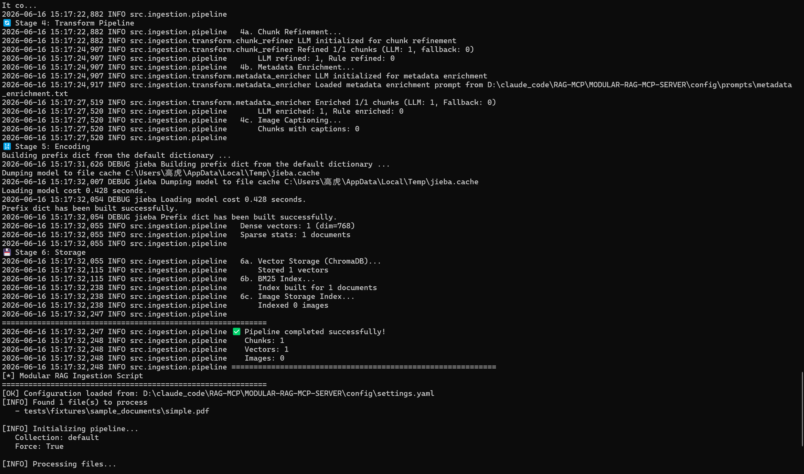
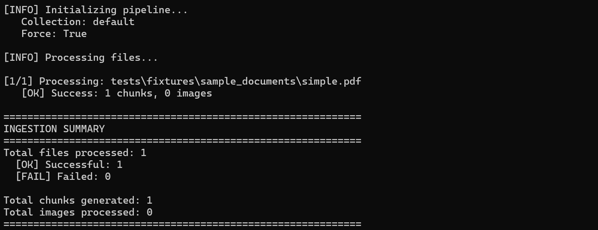
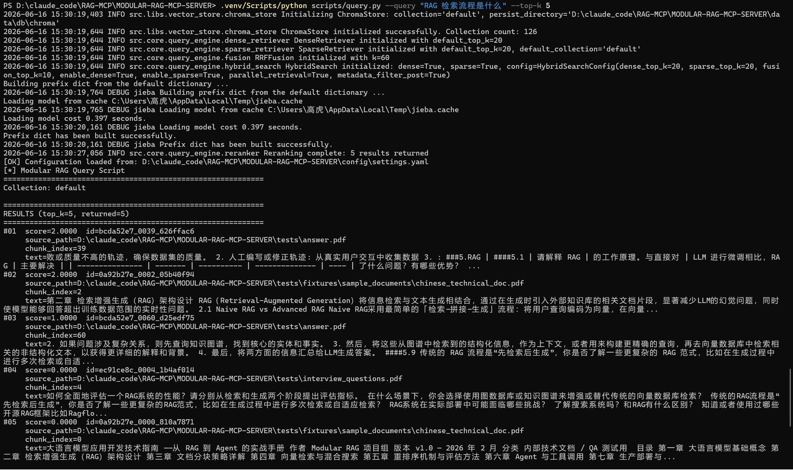

# 模块化 RAG 知识库问答系统

面向个人知识管理场景的模块化 RAG 问答系统，支持 PDF / TXT / Markdown 文档输入，围绕离线索引、在线检索、MCP 协议、评估体系四个环节完成全链路实现。


*图1：文档摄入流程——完整 6 阶段日志（加载、切块、转换）*


*图2：文档摄入流程——完整 6 阶段日志（编码、存储）*


*图3：摄入结果汇总——1 个 chunk 成功存储*


*图4：混合检索结果——BM25 + Dense 双路召回，RRF 融合，LLM Rerank 精排*

## 核心功能

- **混合检索**：BM25 稀疏检索 + Dense 稠密检索双路召回，RRF 融合，LLM Rerank 精排
- **MCP 协议**：基于 Model Context Protocol 标准化 Tool 接口，支持 AI 客户端即插即用
- **Ingestion Pipeline**：PDF → 语义切块 → LLM 精炼 → 双路向量化 → ChromaDB 存储
- **评估体系**：基于 RAGAS + Golden Test Set，量化 Hit Rate、MRR、Faithfulness 等指标

## 环境要求

- Python >= 3.10
- Ollama（本地运行 Embedding 模型）
- DeepSeek API Key（或其他 OpenAI 兼容 API）

## 快速开始

```bash
# 1. 克隆项目
git clone https://github.com/cengjingyangwang/model_RAG_new.git
cd model_RAG_new

# 2. 创建虚拟环境
python -m venv .venv
# Windows:
.venv\Scripts\activate
# macOS/Linux:
# source .venv/bin/activate

# 3. 安装依赖
pip install -e ".[dev]"

# 4. 修改配置
# 编辑 config/settings.yaml，填入你的 API Key

# 5. 摄入文档
python scripts/ingest.py --path your_document.pdf

# 6. 查询
python scripts/query.py --query "你的问题"

# 7. 启动 MCP Server（可选）
python src/mcp_server/server.py
```

## 技术栈

Python / Hybrid Search (BM25 + Dense) / RRF / LLM Rerank / MCP Protocol / ChromaDB / Ollama / DeepSeek / RAGAS
